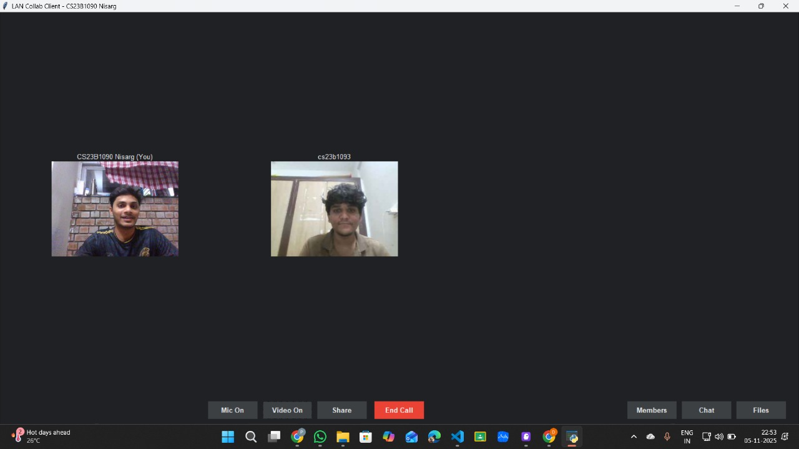
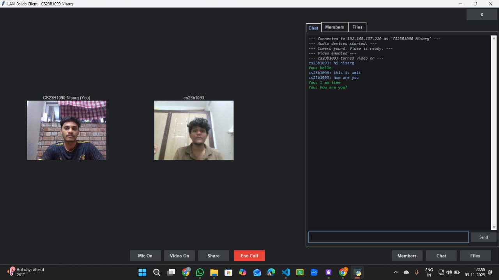
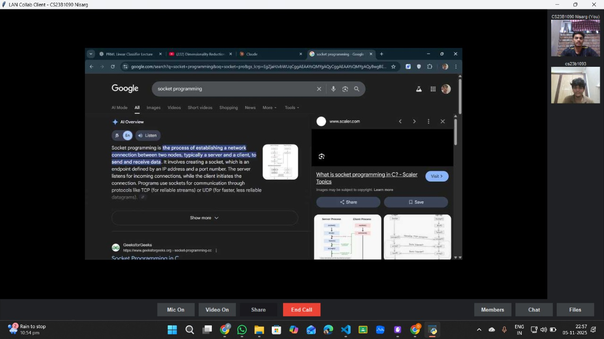
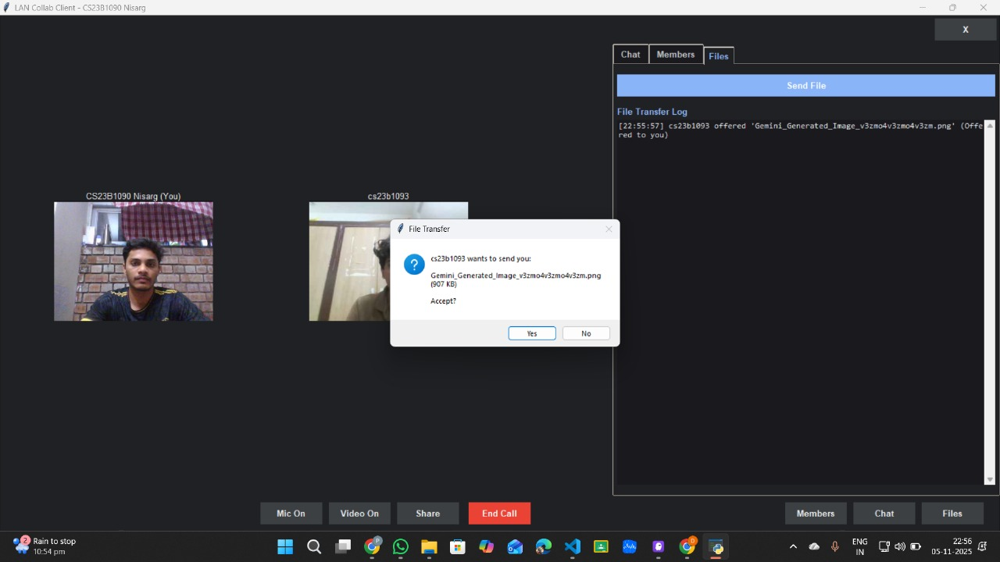
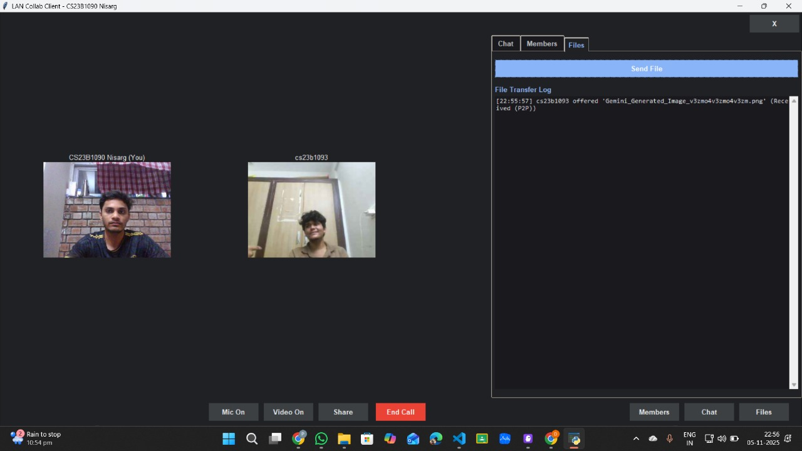
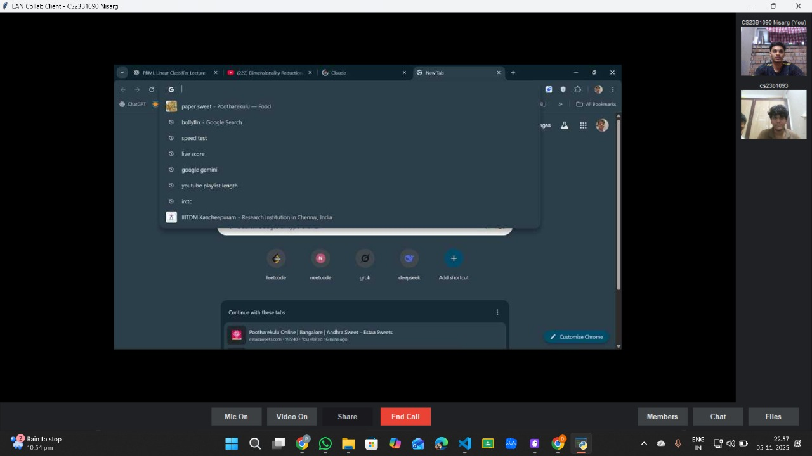
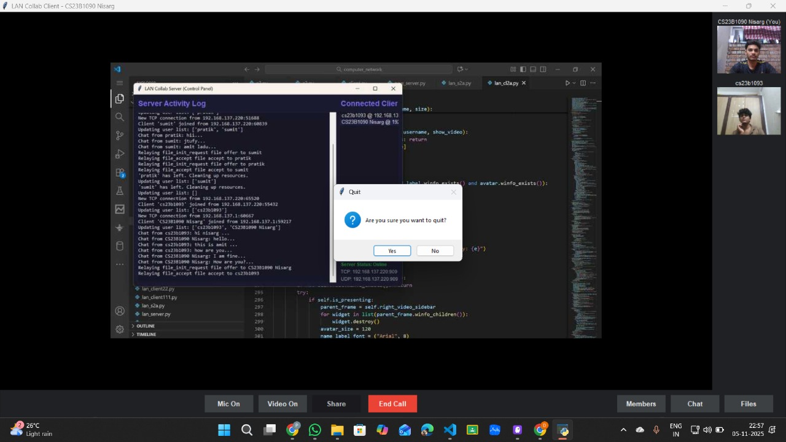

# 🖥️ LAN Collaboration Suite

A real-time, LAN-based collaboration application built with **Python sockets, threading, and Tkinter** — supporting live video calls, audio, group chat, screen sharing, and peer-to-peer file transfer, all over a local network. Built as a Computer Networks project.

---

## ✨ Features

- **🎥 Video Calling** — Multi-participant video grid streamed over UDP, with a modern dark-themed gallery view
- **🎙️ Audio Calling** — Real-time voice streaming alongside video
- **💬 Group Chat** — Instant text messaging visible to all connected clients, with join/leave/system logs
- **🖥️ Screen Sharing** — Share your screen with request/grant/deny controls, pause, fullscreen, and zoom-to-fit for viewers
- **📁 File Transfer** — Send and receive files with accept/decline prompts, live transfer logs, and peer-to-peer (P2P) delivery
- **👥 Member List** — See who's currently connected to the session
- **🗄️ Server Console** — A control-panel-style activity log on the server showing every connection, chat message, and file relay in real time

---

## 🏗️ Architecture

The suite follows a classic **client-server model**, with the server acting as a relay/coordinator for chat, file offers, and screen-share permissions, while video and audio are streamed directly over dedicated UDP sockets for low latency.

| Component | File | Role |
|---|---|---|
| Server | `server.py` | `CollaborationServer` — accepts connections, relays chat/files/screen requests, manages the client registry |
| Client | `client.py` | `CollaborationClient` (networking) + `ModernClientGUI` (Tkinter dark-theme UI) |
| Config | `config.py` | Central settings for ports, buffer sizes, media quality, and protocol message types |

**Tech stack:** Python · `socket` · `threading` · `tkinter` · OpenCV (`cv2`) · `pyaudio` · `Pillow` (`PIL`) · JSON-based messaging protocol

### Ports & Protocols

| Port | Purpose | Protocol |
|---|---|---|
| 5000 | Control channel — connect, chat, member updates | TCP |
| 5001 | Video stream | UDP |
| 5002 | Audio stream | UDP |
| 5003 | Screen share stream | TCP |
| 5004 | File transfer | TCP |

### Key settings (from `config.py`)

- Video: 640×480 @ 20 FPS, JPEG quality 75
- Audio: 44.1 kHz, mono, 16-bit
- Screen share: 5 FPS, quality 70, scaled to 0.75× (max 1280×720)
- File transfer: up to 100 MB per file, 64 KB chunks
- Server: up to 100 concurrent clients, 300s connection timeout

---

## 📸 Screenshots

Below are various screenshots showcasing the features of the LAN Collaboration Suite, including video calling, real-time chat, file transfer, screen sharing, and the server activity log.

<p align="center">
  
  
  
  
  
  
  
</p>

---

## ⚙️ Installation

**Requirements:** Python 3.8+, and a machine with a webcam/microphone for full functionality.

```bash
pip install opencv-python numpy pyaudio pillow
```

> `tkinter`, `socket`, `threading`, `json`, and `struct` are part of the Python standard library and need no separate install.
>
> On Windows, `pyaudio` usually installs directly via pip. On Linux, you may need `sudo apt install portaudio19-dev` first.

---

## 🚀 Usage

1. **Start the server** on one machine (this becomes the host):
   ```bash
   python server.py
   ```
   The server prints its status and begins listening on the ports above. Note the host machine's LAN IP address (e.g. `192.168.x.x`).

2. **Start the client** on each participant's machine:
   ```bash
   python client.py
   ```

3. In the client window, enter the **server's IP address** and a **username**, then click **Connect**.

4. Once connected, use the bottom toolbar to toggle **Mic**, **Video**, **Share** (screen), or **End Call**, and the right-hand panel to switch between **Chat**, **Members**, and **Files**.

All clients must be on the same local network as the server.

---

## 📂 Project Structure

```
.
├── server.py     # CollaborationServer — connection handling, relaying, logging
├── client.py     # CollaborationClient + ModernClientGUI — networking & Tkinter UI
├── config.py     # Ports, buffer sizes, media settings, protocol message constants
└── images/       # Screenshots used in this README
```

---

## 👤 Author

**Nisarg Rande** (CS23B1090) — IIITDM Kancheepuram
[github.com/nisargranade](https://github.com/nisargranade)
